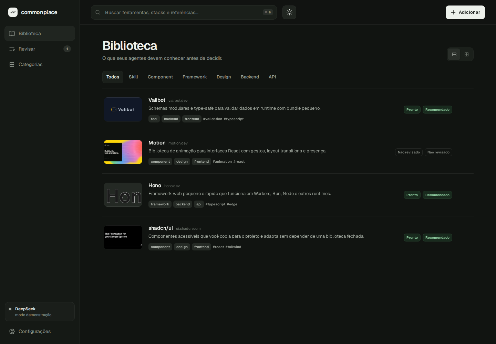

# ai coding agents don't have taste. you do (maybe).

A basic, stateless MCP that agents call when making decisions, backed by your curated development bookmarks.

So it's your fault now when things go wrong.



--AI SLOP BELOW--
## How it works

Taste MCP includes a web interface for collecting, reviewing, and organizing development resources. When a bookmark is added, its content is fetched and passed to an LLM, which analyzes the resource and produces a concise summary, categories, and tags.

The result is stored locally alongside your human review signals, creating a curated knowledge base designed to give coding agents useful context during implementation, architecture, and design decisions.

> [!NOTE]
> The Web UI, enrichment pipeline, and local persistence are working today. The stateless MCP interface is the next milestone and is not implemented yet.

## Quick start with Docker

You only need [Docker Desktop](https://www.docker.com/products/docker-desktop/) or Docker Engine with the Compose plugin.

```bash
git clone https://github.com/JVPVO/taste-mcp.git
cd taste-mcp
cp .env.example .env
docker compose up -d --build
```

Open [http://localhost:8787](http://localhost:8787).

The `.env` file is optional. Without an API key, the enrichment flow runs in demo mode.

## Configure AI enrichment

Add your DeepSeek API key to `.env`:

```dotenv
DEEPSEEK_API_KEY=your-key
```

Then recreate the container:

```bash
docker compose up -d --build
```

You can also enter the key in the Web UI. Keys entered there are held only in server memory and are discarded when the process restarts.

To change the local address or port, edit these optional values in `.env`:

```dotenv
APP_HOST=127.0.0.1
APP_PORT=8787
```

## Useful commands

```bash
docker compose logs -f          # follow application logs
docker compose ps               # check status and health
docker compose down             # stop without deleting your data
docker compose up -d --build    # rebuild after pulling an update
```

The SQLite database and captured media are kept in a Docker volume. Running `docker compose down` preserves them; running `docker compose down -v` deletes them.

## Run without Docker

This project requires Bun 1.3 or newer.

```bash
bun install
cp .env.example .env
bun run dev
```

The development Web UI runs at [http://localhost:5173](http://localhost:5173), with the API on port `8787`.

For a production build without Docker:

```bash
bun run build
bun start
```

## Current capabilities

- Curated library with search, filters, categories, and human review signals.
- Review queue for production readiness and favorability.
- URL ingestion with optional human context.
- Live enrichment progress over server-sent events.
- Structured DeepSeek output validated with Valibot.
- Public GitHub repository metadata and README extraction without a GitHub token.
- Local snapshots of X posts, including text, metadata, and available media.
- SQLite persistence with WAL mode and prepared statements.
- Responsive light and dark themes with reduced-motion support.
- Demo enrichment when no API key is configured.

## Security and privacy

- `.env`, SQLite files, and captured media are excluded from Git and Docker build contexts.
- The container runs as a non-root user with privilege escalation disabled.
- Docker binds the application to `127.0.0.1` by default.
- The application currently has no authentication. Do not bind it to a public interface unless it is protected by an authenticated HTTPS proxy.
- Public GitHub pages are read without a GitHub token. Private repositories are not supported.

Your bookmarks and reviews remain in your local SQLite database. Back up the Docker volume or the local `data/` directory before moving installations.
